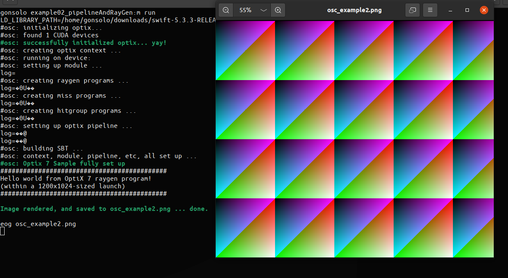

# A software implementation of Optix 7

Based on: Siggraph 2019/2020 OptiX 7/7.1 Course Tutorial Code


# About this repository  

This repository implements Optix in Software. It was written to learn the Optix API.
It mainly consists of parts of an pathtracer I wrote (https://github.com/gonsolo/gonzales)
as rendering engine and glue code implementing the Optix API.
The API was implemented step by step, starting with example 01 and progressively extended
as can be seen in the history.

This repository was forked from the original course at https://gitlab.com/ingowald/optix7course.git.

# Building the Code

"make" builds everything. Then go to an example and type "make run".
I only tested it on Linux.

## Dependencies

- a C++ compiler (gcc 10.2)
- a Swift compiler (swiftc 5.3.3).
- no Optix SDK, Cuda or Nvidia drivers are needed. ;)
- GLFW

## Building under Linux

- Install required packages

    - on Ubuntu: `sudo apt install libglfw3-dev`

- Clone the code
```
    git clone https://github.com/gonsolo/optix7course
    cd optix7course
```

- build
```
    make
```

- run an example
```
    cd example01_helloOptix; make run
```

# Examples Overview
	
## Example 1: Hello World 

This is simplest example and only needs a few lines to implement.

This is how it looks on my Linux machine:


## Example 2: First Pipeline Setup and Raygen Program




## Example 3: Rendering in a GLFW Window 


## Example 4: Creating a first Triangle Mesh and Accel Struct 


## Example 5: First Shader Binding Table (SBT) Data 


## Example 6: Multiple Triangle Meshes 


## Example 7: First Real Model


## Example 8: Adding Textures via CUDA Texture Objects


## Example 9: Adding a second ray type: Shadows

TODO

<!--

-->

## Example 10: Soft Shadows

TODO

<!--

-->

## Example 11...

I haven't yet written a denoiser so I didn't bother implementing these
examples.

